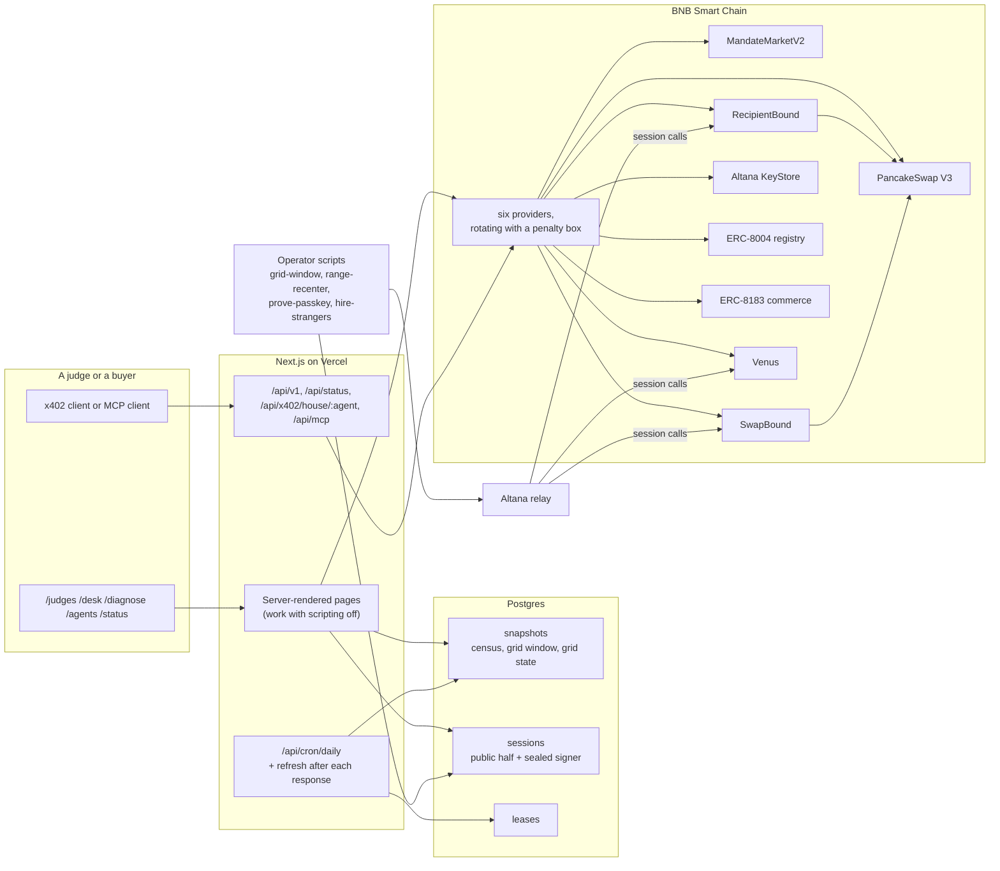

# Architecture

**Reads** go through one rotating transport over six BSC providers
(`src/lib/chain/rpc.ts`). A provider that fails is skipped for a minute; `/status`
prints each one's latency.

**Numbers** come from snapshots. The committed JSON in `src/data` is the floor;
newer readings live in Postgres and are loaded at the top of each render.
Judge-facing pages refresh the census after the response when it is older than
fifteen minutes, one instance at a time by a lease row.

**Authority** is Altana sessions on the demo account. The public half of each
session (key, allowlist, caps, expiry) is plain columns; the signer is sealed
with AES-256-GCM. `/desk` compares what we granted with what the KeyStore holds.

**Value** only moves through calls with no recipient argument: RecipientBound
for positions, SwapBound for swaps, Venus markets that act for the caller.
